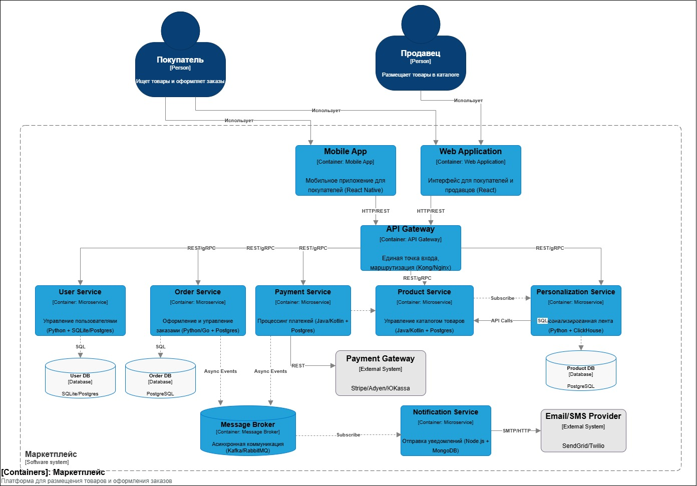
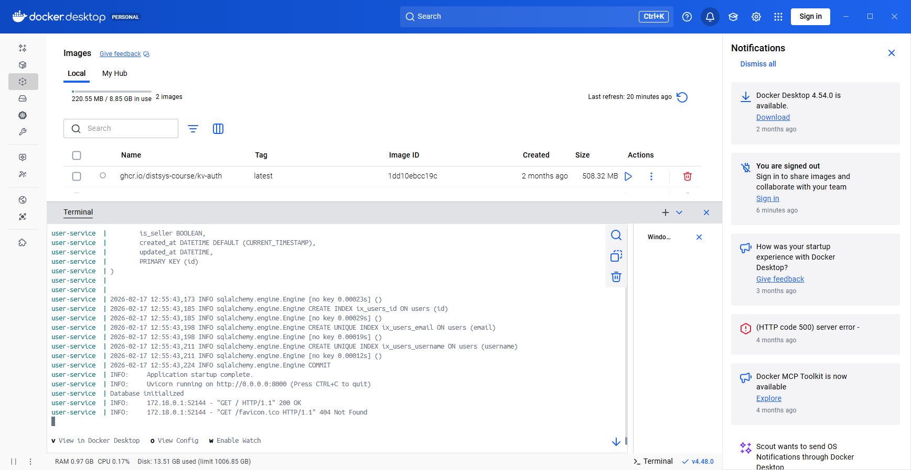
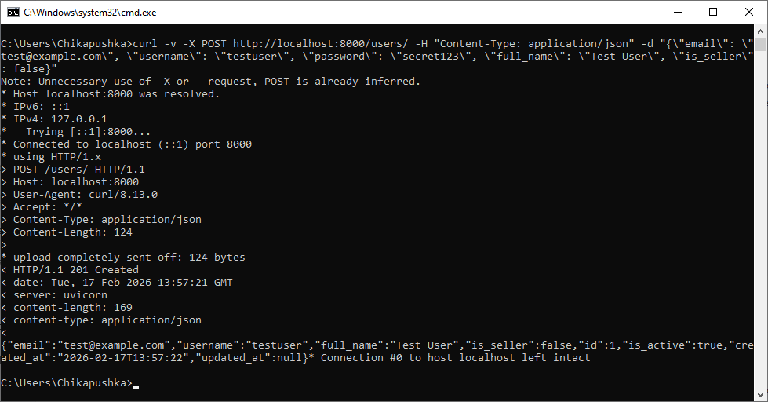

# Архитектура маркетплейса

## 1. Выделение доменов и их ответственность

Список предметных доменов маркетплейса с описанием их зон ответственности, согласно требованиям:

### Домен "Пользователи" (Identity & Access)
**Ответственность:** Регистрация, аутентификация и авторизация пользователей (покупателей и продавцов). Хранение профилей (ФИО, email, контакты, роли). Управление сессиями.

### Домен "Товары / Каталог"
**Ответственность:** Управление товарным каталогом от лица продавцов (CRUD товаров: создание, редактирование, удаление, категории, атрибуты, остатки, цены). Хранение master-данных товаров.

### Домен "Заказы"
**Ответственность:** Оформление заказов покупателями. Управление жизненным циклом заказа (создан, оплачен, передан в доставку, завершен). Хранение информации о составе заказа.

### Домен "Платежи"
**Ответственность:** Расчет стоимости заказа (с учетом скидок/комиссий). Проведение платежей через внешние шлюзы. Учет транзакций (хранение истории платежей). Взаимодействие с платежными провайдерами.

### Домен "Уведомления"
**Ответственность:** Отправка уведомлений пользователям о событиях (подтверждение регистрации, изменение статуса заказа и т.д.) по разным каналам (email, push, смс). Управление шаблонами уведомлений.

### Домен "Персонализация / Лента"
**Ответственность:** Формирование персонализированной ленты товаров для конкретного пользователя. Сбор и анализ пользовательских событий (просмотры, клики, покупки) для построения рекомендаций. Расчет персональных предложений.

---

## 2. Распределение доменов по сервисам и границы владения данными

Основываясь на выделенных доменах, спроектирована архитектура, состоящая из нескольких микросервисов. Каждый сервис владеет своими данными и отвечает за свою предметную область. Взаимодействие между сервисами спроектировано с учетом требований консистентности и производительности.

### 2.1 Распределение доменов по сервисам

Логика разбиения основана на принципе **"One domain, one service"** (Один домен — один сервис) для минимизации связанности. Исключение составляет домен "Персонализация", который вынесен в отдельный сервис, так как имеет специфические требования к данным и нагрузке (аналитические запросы, работа с большими объемами событий).

| Сервис | Входящие домены | Логика объединения/разделения |
|:---|:---|:---|
| **User Service** | Пользователи | Выделен в отдельный сервис, так как является основой для безопасности и идентификации во всей системе. |
| **Product Catalog Service** | Товары / Каталог | Выделен в отдельный сервис, так как отвечает за хранение и управление основной товарной номенклатурой. Имеет высокие требования к производительности на чтение (каталог смотрит много пользователей). |
| **Order Service** | Заказы | Выделен в отдельный сервис, так как управляет бизнес-процессом (заказ) и его статусами. Требует высокой надежности и транзакционности внутри себя. |
| **Payment Service** | Платежи | Выделен в отдельный сервис из-за работы с чувствительными данными и внешними платежными системами. Требует особых мер безопасности и соответствия стандартам (PCI DSS). |
| **Notification Service** | Уведомления | Выделен в отдельный сервис, чтобы не смешивать бизнес-логику с логикой доставки уведомлений. Позволяет гибко менять провайдеров рассылок. |
| **Personalization Service** | Персонализация / Лента | Выделен в отдельный сервис, так как его архитектура часто отличается от других (использование колоночных БД, кэшей, OLAP-хранилищ). Позволяет вычислительно-емкие задачи не влиять на основные сервисы. |

### 2.2 Границы владения данными и взаимодействие сервисов

У каждого сервиса есть **собственная база данных**. Никакой другой сервис не имеет прямого доступа к базе данных другого сервиса. Взаимодействие происходит только через API.

| Сервис | Владение данными (Master Data) | Ответственность | Способы взаимодействия с другими сервисами |
|:---|:---|:---|:---|
| **User Service** | Имена, email, пароли (хэши), роли, адреса пользователей. | Регистрация, логин, валидация токенов, управление профилем. | **(Синхронно, REST/gRPC):** Order Service проверяет пользователя при оформлении заказа.<br>**(Синхронно):** Product Service получает данные продавца для карточки товара. |
| **Product Catalog Service** | Товары, категории, цены, остатки, описание, идентификатор продавца. | Управление каталогом, поиск товаров, выдача карточек товаров. | **(Синхронно, REST):** Personalization Service получает данные о товарах для ленты. Order Service получает цены и остатки при оформлении заказа. |
| **Order Service** | Заказы (ID пользователя, состав заказа (ID товара, цена на момент заказа), статус, сумма). | Создание заказов, управление статусами, проверка возможности заказа. | **(Синхронно):** Общается с Product Service для проверки остатков.<br>**(Асинхронно, Kafka/RabbitMQ):** Публикует события об изменении статуса заказа (`OrderCreated`, `OrderPaid`, `OrderCancelled`). |
| **Payment Service** | Транзакции (ID заказа, сумма, статус платежа), связь с внешними платежами. | Процессинг платежей, расчет комиссий, вызов внешних шлюзов. | **(Асинхронно):** Подписывается на события `OrderCreated` от Order Service для инициации оплаты.<br>**(Синхронно, Webhook/API Call):** Внешний шлюз уведомляет Payment Service о результате.<br>**(Асинхронно):** Публикует события `PaymentSucceeded` / `PaymentFailed`. |
| **Notification Service** | Email/телефоны пользователей (кэширует/получает из User Service), шаблоны уведомлений. | Отправка email/push/sms по событиям. | **(Асинхронно):** Подписывается на события всех сервисов (`UserRegistered`, `OrderStatusChanged`, `PaymentFailed` и т.д.). При получении события формирует и отправляет уведомление. |
| **Personalization Service** | События пользователей (просмотры, клики), фичи (векторы предпочтений), готовые персональные подборки товаров. | Сбор событий, обучение моделей, формирование и выдача персонализированной ленты. | **(Асинхронно):** Слушает события просмотров/кликов из фронтенда (или через брокер сообщений).<br>**(Синхронно, gRPC/REST):** При запросе ленты от фронтенда обращается к Product Service для обогащения данных свежими ценами/названиями. |

---

## 3. Альтернативные варианты декомпозиции

Перед финализацией архитектуры были рассмотрены два альтернативных подхода к разбиению системы. Они существенно отличаются от целевого варианта.

### Вариант А: Монолит с выделенными модулями

В этом варианте вся бизнес-логика находится в рамках одного приложения, но код внутри структурирован по доменам. База данных также общая, но схема может быть разделена на логические наборы таблиц (например, `user_*`, `order_*`).

**Плюсы (+):**
- **Простота разработки и развертывания**, единый код, единый репозиторий, единый процесс сборки и деплоя. На ранних этапах стартапа это позволяет быстрее разрабатывать фичи.
- **Однородность данных**, легко обеспечить ACID-транзакции между разными частями системы, так как все в одной БД.
- **Простота отладки**, сквозные запросы легче трассировать в рамках одного приложения.

**Минусы (-):**
- **Сложность масштабирования**, невозможно масштабировать компоненты по отдельности, если модуль "Каталог" потребляет много CPU, масштабировать придется весь монолит целиком, даже если модуль "Уведомления" простаивает.
- **Риск "застывания" архитектуры**, модули со временем имеют тенденцию тесно связываться, что затрудняет выделение их в отдельные сервисы в будущем.
- **Сложность внесения изменений**, требуется пересборка и перезапуск всего приложения.
- **Технологическая ограниченность**, весь проект вынужден использовать один стек технологий.

### Вариант Б: Микросервисы по бизнес-способностям

Этот вариант близок к изначальному проекту, но с другим объединением доменов, тут объединяем тесно связанные процессы, даже если они относятся к разным доменам по DDD.

- **Сервис "Управление заказом и платежом" (Order & Payment Service)** - объединяет логику оформления заказа и проведения платежа в один сервис.
- **Сервис "Управление продавцом и каталогом" (Seller & Catalog Service)** - продавец управляет и своим профилем, и товарами в одном контексте.
- **Сервис "Покупатель и уведомления" (Buyer & Notification Service)** - управление профилем покупателя и отправка ему уведомлений.

**Плюсы (+):**
- **Согласованность бизнес-процессов**, процесс "заказ-оплата" находится в одном сервисе, что упрощает поддержание консистентности, не требуя сложных распределенных транзакций между двумя разными сервисами.
- **Меньше сетевых вызовов**, для выполнения ключевой бизнес-операции требуется меньше внутрисервисных вызовов, что снижает задержки.
- **Меньше операционных затрат**, управлять 3-4 сервисами проще , чем 6-ю.

**Минусы (-):**
- **Размытие границ доменов**, со временем логика платежей может сильно "срастись" с логикой заказов, и разделить их позже будет крайне сложно.
- **Нарушение принципа единственной ответственности**, сервис отвечает за слишком многое, а изменение в логике платежей может потребовать перезапуска всего сервиса, что затронет процессинг заказов.
- **Риски безопасности**, смешивание платежных данных с данными заказов увеличивает поверхность атаки и усложняет соответствие стандартам безопасности.

---

## 4. Trade-off's вариантов и обоснование финального выбора

### 4.1 Сравнительный анализ Trade-off's

| Критерий | Вариант А: Модульный Монолит | Вариант Б: Микросервисы по бизнес-способностям | Вариант В (Целевой): Микросервисы по доменам |
|:---|:---|:---|:---|
| **Скорость разработки (Time-to-Market)** | Высокая на старте. Проще делать миграции БД, проще отладка. |  Средняя. Нужно проектировать границы сервисов, но их меньше. |  Средняя. Требуется тщательное проектирование контрактов и API. |
| **Масштабируемость** | Низкая. Масштабируется только вертикально или целиком горизонтально. | Высокая. Можно независимо масштабировать узкие места (например, Catalog). | Высокая. Максимальная гибкость в масштабировании. |
| **Отказоустойчивость** | Низкая. Ошибка в модуле уведомлений может уронить весь заказ (падение процесса). |  Средняя. Падение Order & Payment остановит и заказы, и платежи сразу. | Высокая. Падение Payment Service не остановит прием заказов (они уйдут в статус "Ожидание оплаты"). |
| **Сложность разработки (Technical Complexity)** | Низкая. |  Средняя. Транзакции становятся распределенными. |  Средняя. Транзакции становятся распределенными, плюс много сетевых вызовов. |
| **Сложность операционного управления (DevOps)** | Низкая. Один контейнер, один лог, один мониторинг. |  Средняя. Оркестровка нескольких контейнеров, управление конфигами. | Высокая. Много сервисов, сложные схемы деплоя, Service Mesh и т.д. |
| **Безопасность данных** |  Средняя. Платежные данные в одной БД с остальными, но проще контролировать доступ на уровне приложения. |  Средняя. Платежные данные изолированы от каталога, но могут смешиваться с заказами. | Высокая. Максимальная изоляция чувствительных данных (платежи отдельно). |
| **Гибкость технологического стека** | Отсутствует. Весь проект на одном языке и БД. |  Ограниченная. Часть сервисов может использовать разные БД, но логика внутри сервиса однородна. | Полная. Каждый сервис можно писать на оптимальном для него языке/БД. |

### 4.2 Обоснование финального выбора

**Финальный выбор** это **Вариант В - Микросервисы по доменам** (User, Product, Order, Payment, Notification, Personalization). Данное решение продиктовано требованиями кейса и предположением о долгосрочном развитии системы:

1.  **Требование персонализации** - домен "Персонализация" требует специфической архитектуры, выделение его в отдельный сервис позволяет использовать оптимальный стек, не нагружая основной каталог и не рискуя его стабильностью.

2.  **Разные паттерны нагрузки:**
    *   **Product Catalog** чтение (Read-Heavy), Пользователи постоянно листают ленту.
    *   **Order Service:** - запись (Write-Heavy) во время распродаж, требует надежности и правильной работы с конкурентностью.
    *   **Payment Service** - критичен по безопасности.
    
    Объединение этих разнородных нагрузок в одном сервисе (как в варианте А или Б) приведет к тому, что мы не сможем оптимально настроить инфраструктуру под каждую задачу. Придется либо переплачивать за избыточные ресурсы, либо мириться с падением производительности.

3.  **Соответствие принципам DDD и микросервисов** - Вариант В обеспечивает **слабую связанность** и **высокую связность**, а каждый сервис делает только то, что должен, и ничего лишнего. 

4.  **Требование к разделению данных** -  текущее задание явно указывает на необходимость определения границ владения данными и отсутствие разделяемых БД. Вариант В выполняет это требование "из коробки" наиболее строго. Вариант Б подразумевает разделение, но более крупными блоками, что может привести к тому, что через год мы все равно придем к декомпозиции варианта В, но уже с "раздутыми" сервисами, которые будет больно резать.

Несмотря на более высокую начальную сложность, вариант В является архитектурой "на будущее" и соответствует требованиям задания и позволяет развивать функции (ленту, платежи) независимо друг от друга.

---

## 5. C4 Container диаграмма

### 5.1 Диаграмма



*Рисунок 1 - C4 Container диаграмма архитектуры маркетплейса*

### 5.2 Описание компонентов

| Компонент | Назначение | Технологии |
|:---|:---|:---|
| **Web Application** | Интерфейс для покупателей и продавцов | React |
| **Mobile App** | Мобильное приложение для покупателей | React Native |
| **API Gateway** | Единая точка входа, маршрутизация, аутентификация | Kong/Nginx |
| **User Service** | Управление пользователями | Python + SQLite (на этапе разработки), в production планируется PostgreSQL |
| **Product Service** | Управление товарным каталогом | Java/Kotlin + PostgreSQL + Redis |
| **Order Service** | Оформление и управление заказами | Python/Go + PostgreSQL |
| **Payment Service** | Процессинг платежей | Java/Kotlin + PostgreSQL |
| **Notification Service** | Отправка уведомлений | Node.js + MongoDB |
| **Personalization Service** | Персонализированная лента | Python + ClickHouse + Redis |
| **Message Broker** | Асинхронная коммуникация | Kafka/RabbitMQ |

В рамках данной работы реализован **User Service** с использованием SQLite для упрощения развертывания и тестирования. В production-окружении предполагается замена на PostgreSQL.

### 5.3 Взаимодействие между компонентами

**Синхронные связи (REST/gRPC):**
- API Gateway → все сервисы
- Personalization Service → Product Service

**Асинхронные связи (Kafka/RabbitMQ):**
- Order Service → Message Broker (события заказов)
- Payment Service → Message Broker (события платежей)
- Notification Service ← Message Broker (подписка на все события)

---

## 6. Реализация сервиса (User Service)

В соответствии с заданием, реализован один микросервис - **User Service** с базовым health-check endpoint.

### 6.1 Технологический стек

| Компонент | Технология |
|:---|:---|
| Язык программирования | Python 3.11 |
| Веб-фреймворк | FastAPI |
| База данных | SQLite (для разработки) |
| ORM | SQLAlchemy (асинхронный) |
| Контейнеризация | Docker + Docker Compose |

### 6.2 Структура проекта
## 6. Реализация сервиса (User Service)

В соответствии с заданием, реализован один микросервис - **User Service** с базовым health-check endpoint.

### 6.1 Технологический стек

| Компонент | Технология |
|:---|:---|
| Язык программирования | Python 3.11 |
| Веб-фреймворк | FastAPI |
| База данных | SQLite (для разработки) |
| ORM | SQLAlchemy (асинхронный) |
| Контейнеризация | Docker + Docker Compose |

### 6.2 Структура проекта

```
user-service/
├── app/
│ ├── init.py
│ ├── main.py # Точка входа FastAPI
│ ├── database.py # Подключение к БД
│ ├── models.py # Модели SQLAlchemy
│ ├── schemas.py # Pydantic схемы
│ └── routers/
│ ├── init.py
│ ├── health.py # Health check endpoints
│ └── users.py # CRUD пользователей
├── requirements.txt # Зависимости
├── Dockerfile
├── docker-compose.yml
└── README.md
```

### 6.3 Инструкция по запуску
```
# Клонировать репозиторий
git clone <>
cd user-service

# Запустить в Docker
docker-compose up --build
```



```
# Проверить health check
curl http://localhost:8000/health

# Ожидаемый ответ:
# {
#   "status": "OK",
#   "service": "user-service",
#   "timestamp": "2026-02-17T12:57:58.325800",
#   "database": "connected"
# }
```


```
# Создать пользователя
curl -X POST http://localhost:8000/users \
  -H "Content-Type: application/json" \
  -d '{
    "email": "test@example.com",
    "username": "testuser",
    "password": "secret123",
    "full_name": "Test User",
    "is_seller": false
  }'
```



```
# Документация API
# http://localhost:8000/docs
```


