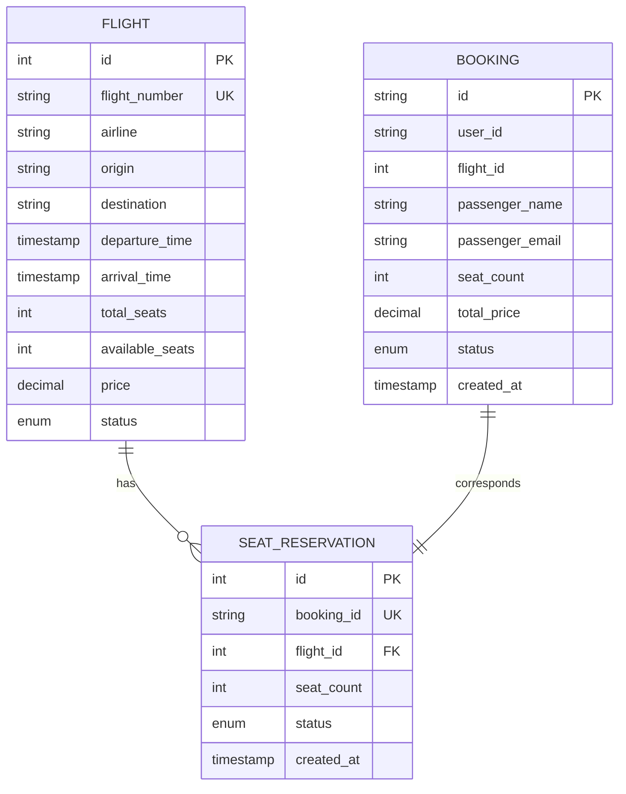

# Flight Booking System

## Структура проекта

```text
flight-booking-system/
├── docker-compose.yml
├── proto/
│   └── flight_service.proto
├── booking-service/
│   ├── Dockerfile
│   ├── requirements.txt
│   ├── app/
│   │   ├── __init__.py
│   │   ├── main.py
│   │   ├── models.py
│   │   ├── schemas.py
│   │   ├── database.py
│   │   └── flight_client.py
│   └── migrations/
│       └── V1__init.sql
├── flight-service/
│   ├── Dockerfile
│   ├── requirements.txt
│   ├── app/
│   │   ├── __init__.py
│   │   ├── server.py
│   │   ├── models.py
│   │   ├── database.py
│   │   ├── redis_client.py
│   │   └── auth.py
│   └── migrations/
│       ├── V1__create_types.sql
│       └── V2__create_tables.sql
└── scripts/
    └── generate_proto.sh
```


## gRPC-контракт (4 обязательных метода)
```protobuf
service FlightService
{
    rpc SearchFlights (SearchFlightsRequest) returns (SearchFlightsResponse);
    rpc GetFlight (GetFlightRequest) returns (Flight);
    rpc ReserveSeats (ReserveSeatsRequest) returns (ReserveSeatsResponse);
    rpc ReleaseReservation (ReleaseReservationRequest) returns (google.protobuf.Empty);
}
```

## Генерация кода
```
# для booking-service
cd booking-service/proto
./generate.sh
cd ../..

#  для flight-service
cd flight-service/proto
./generate.sh
cd ../..
```
## Контейнеры в Docker 
- booking-service (REST API на порту 8000, PostgreSQL база)
- flight-service (gRPC сервер на порту 50051,PostgreSQL база, Redis для кеширования)
- postgres-booking (База  booking_db)
- postgres-flight (База flight_db)
- redis-master (Основной Redis, Кеширование данных)
- redis-replica (Реплика Redis для отказоустойчивости)

## ER-диаграмма



## PostgreSQL + реализация сервисов

### Реализованые базы данных 

```bash
docker ps | findstr postgres

#результат команды
36cfc55836e9   postgres:15                             "docker-entrypoint.sтАж"   2 hours ago   Up 2 hours (healthy)   0.0.0.0:5432->5432/tcp, [::]:5432->5432/tcp       flight-booking-system-postgres-booking-1
63be75d9bd18   postgres:15                             "docker-entrypoint.sтАж"   2 hours ago   Up 2 hours (healthy)   0.0.0.0:5433->5432/tcp, [::]:5433->5432/tcp       flight-booking-system-postgres-flight-1
```


### Миграции 
```bash
docker logs flight-booking-system-flight-service-1 | findstr Migration

#результат команды
INFO:__main__:Flight Service starting on port 50051
INFO:app.redis_client:CACHE MISS: search:SVO:LED
INFO:__main__:CACHE MISS: search:SVO:LED
INFO:app.redis_client:CACHE SET: search:SVO:LED (TTL: 300s)
INFO:__main__:CACHE SET: search:SVO:LED (TTL: 300s)
INFO:app.redis_client:CACHE HIT: search:SVO:LED
INFO:__main__:CACHE HIT: search:SVO:LED
INFO:app.redis_client:CACHE MISS: flight:1
INFO:__main__:CACHE MISS: flight:1
INFO:app.redis_client:CACHE SET: flight:1 (TTL: 600s)
INFO:__main__:CACHE SET: flight:1 (TTL: 600s)
INFO:__main__:Reserved 2 seats on flight 1 for booking 2817fdaf-1587-4336-9f16-1b14bc015c48
INFO:app.redis_client:CACHE INVALIDATED: flight:1 (1 keys)
Migration V1__create_types.sql applied successfully
Migration V2__create_tables.sql applied successfully
```

```bash
docker logs flight-booking-system-booking-service-1 | findstr Migration

#результат команды
INFO:     Will watch for changes in these directories: ['/app']
INFO:     Uvicorn running on http://0.0.0.0:8000 (Press CTRL+C to quit)
INFO:     Started reloader process [8] using StatReload
INFO:     Started server process [10]
INFO:     Waiting for application startup.
INFO:     Application startup complete.
Migration V1__init.sql applied successfully
Migration V2__test_data.sql applied successfully
```

### Проверка работы сервисов
```bash
docker ps | findstr service

#результат команды
2dbe1fe9e3a7   flight-booking-system-booking-service   "/bin/sh -c 'python тАж"   2 hours ago   Up 2 hours             0.0.0.0:8000->8000/tcp, [::]:8000->8000/tcp       flight-booking-system-booking-service-1
9bb3ae65090c   flight-booking-system-flight-service    "/bin/sh -c 'python тАж"   2 hours ago   Up 2 hours             0.0.0.0:50051->50051/tcp, [::]:50051->50051/tcp   flight-booking-system-flight-service-1
```

### Работа с базой

```bash
# Создание бронирования
curl -X POST http://localhost:8000/bookings \
  -H "Content-Type: application/json" \
  -d '{
    "user_id": "user123",
    "flight_id": 1,
    "passenger_name": "John Doe",
    "passenger_email": "john@example.com",
    "seat_count": 2
  }'


#Результат
{"user_id":"user123","flight_id":1,"passenger_name":"John Doe","passenger_email":"john@example.com","seat_count":2,"id":"ebfed537-3b1b-45b1-af00-b2f86698f34c","total_price":15001.0,"status":"CONFIRMED","created_at":"2026-03-16T19:51:09.576223"}
```


```bash
# Поиск рейсов
curl "http://localhost:8000/flights?origin=SVO&destination=LED"


#Результат
[{"id":1,"flight_number":"SU1234","airline":"Aeroflot","origin":"SVO","destination":"LED","departure_time":"2026-03-17T17:36:09.077421","arrival_time":"2026-03-17T18:36:09.077421","total_seats":150,"available_seats":142,"price":7500.5,"status":0}]
```


```bash
# Отменить конкретное бронирование (например, последнее)
curl -X POST "http://localhost:8000/bookings/ebfed537-3b1b-45b1-af00-b2f86698f34c/cancel"
# Проверить что статус изменился
curl "http://localhost:8000/bookings/ebfed537-3b1b-45b1-af00-b2f86698f34c"


#Результат
{"status":"cancelled","booking_id":"2817fdaf-1587-4336-9f16-1b14bc015c48"}

{"user_id":"user123","flight_id":1,"passenger_name":"Иван Петров","passenger_email":"ivan@email.com","seat_count":2,"id":"2817fdaf-1587-4336-9f16-1b14bc015c48","total_price":15001.0,"status":"CANCELLED","created_at":"2026-03-16T17:49:29.356527"}
```


```bash
#увидеть все рейсы из Москвы (SVO) в Питер (LED)
curl "http://localhost:8000/flights?origin=SVO&destination=LED"


#Результат
[{"id":1,"flight_number":"SU1234","airline":"Aeroflot","origin":"SVO","destination":"LED","departure_time":"2026-03-17T17:36:09.077421","arrival_time":"2026-03-17T18:36:09.077421","total_seats":150,"available_seats":146,"price":7500.5,"status":0}]d
```


```bash
# Все бронирования пользователя user123
curl "http://localhost:8000/bookings?user_id=user123"

#Результат
[{"user_id":"user123","flight_id":1,"passenger_name":"Иван Петров","passenger_email":"ivan@email.com","seat_count":2,"id":"550e8400-e29b-41d4-a716-446655440000","total_price":15001.0,"status":"CONFIRMED","created_at":"2026-03-14T17:36:09.852176"},{"user_id":"user123","flight_id":3,"passenger_name":"Мария Сидорова","passenger_email":"maria@email.com","seat_count":1,"id":"550e8400-e29b-41d4-a716-446655440001","total_price":4500.0,"status":"CONFIRMED","created_at":"2026-03-15T17:36:09.852176"},{"user_id":"user123","flight_id":1,"passenger_name":"Иван Петров","passenger_email":"ivan@email.com","seat_count":2,"id":"2817fdaf-1587-4336-9f16-1b14bc015c48","total_price":15001.0,"status":"CANCELLED","created_at":"2026-03-16T17:49:29.356527"},{"user_id":"user123","flight_id":1,"passenger_name":"Test","passenger_email":"test@test.com","seat_count":2,"id":"c528029e-f198-4f98-9bbe-ab88bf65f5a9","total_price":15001.0,"status":"CONFIRMED","created_at":"2026-03-16T19:16:17.623405"},{"user_id":"user123","flight_id":1,"passenger_name":"Test","passenger_email":"test@test.com","seat_count":2,"id":"4d59b619-4306-4e31-bf6b-bed5f4b5d854","total_price":15001.0,"status":"CONFIRMED","created_at":"2026-03-16T19:16:33.138250"},{"user_id":"user123","flight_id":1,"passenger_name":"John Doe","passenger_email":"john@example.com","seat_count":2,"id":"ebfed537-3b1b-45b1-af00-b2f86698f34c","total_price":15001.0,"status":"CONFIRMED","created_at":"2026-03-16T19:51:09.576223"}]d
```


```bash
# Конкретное бронирование
curl "http://localhost:8000/bookings/550e8400-e29b-41d4-a716-446655440000"


#Результат
{"user_id":"user123","flight_id":1,"passenger_name":"Иван Петров","passenger_email":"ivan@email.com","seat_count":2,"id":"550e8400-e29b-41d4-a716-446655440000","total_price":15001.0,"status":"CONFIRMED","created_at":"2026-03-14T17:36:09.852176"}
```

## Межсервисное gRPC взаимодействие

Рализовано в booking-service/app/flight_client.py

```python
class FlightClient:
    def search_flights(self, origin, destination, date=None):
        request = flight_service_pb2.SearchFlightsRequest(
            origin=origin,
            destination=destination
        )
        return self.stub.SearchFlights(request, metadata=self._get_metadata())
        
```

```bash
# Поиск рейсов через Booking Service (он вызывает Flight Service по gRPC)
curl "http://localhost:8000/flights?origin=SVO&destination=LED"

# Результат
[{"id":1,"flight_number":"SU1234","airline":"Aeroflot","origin":"SVO","destination":"LED","departure_time":"2026-03-17T17:36:09.077421","arrival_time":"2026-03-17T18:36:09.077421","total_seats":150,"available_seats":148,"price":7500.5,"status":0}]
```


## Транзакционная целостность
Рализовано в flight-service/app/server.py

```python
def ReserveSeats(self, request, context):
    db: Session = SessionLocal()
    try:
        # SELECT FOR UPDATE блокирует строку
        flight = db.query(models.Flight).filter(
            models.Flight.id == request.flight_id
        ).with_for_update().first()
        
        # Атомарное обновление
        flight.available_seats -= request.seat_count
        
        # Создание резервации в той же транзакции
        reservation = models.SeatReservation(
            booking_id=request.booking_id,
            flight_id=request.flight_id,
            seat_count=request.seat_count,
            status=models.ReservationStatus.ACTIVE
        )
        db.add(reservation)
        db.commit()  # Все или ничего
```

```bash
# Создать бронирование (транзакция в flight-service)
curl -X POST http://localhost:8000/bookings \
  -H "Content-Type: application/json" \
  -d '{"user_id":"user123","flight_id":1,"passenger_name":"Test","passenger_email":"test@test.com","seat_count":2}'
  
# Результат
{"user_id":"user123","flight_id":1,"passenger_name":"Test","passenger_email":"test@test.com","seat_count":2,"id":"4d59b619-4306-4e31-bf6b-bed5f4b5d854","total_price":15001.0,"status":"CONFIRMED","created_at":"2026-03-16T19:16:33.138250"}
```

## Аутентификация межсервисных вызовов 
Рализовано в flight-service/app/auth.py

```python
class APIKeyInterceptor(grpc.ServerInterceptor):
    def intercept_service(self, continuation, handler_call_details):
        metadata = dict(handler_call_details.invocation_metadata)
        api_key = metadata.get("x-api-key")
        
        if not api_key or api_key != API_KEY:
            return grpc.unary_unary_rpc_method_handler(
                lambda request, context: context.abort(
                    grpc.StatusCode.UNAUTHENTICATED,
                    "Invalid API key"
                )
            )
        return continuation(handler_call_details)
```
в booking-service/app/flight_client.py

```python
def _get_metadata(self):
    return [('x-api-key', 'secret-key-123')]
```

## Redis кеширование (Cache-Aside)
Рализовано в  flight-service/app/server.py

```python
def SearchFlights(self, request, context):
    cache_key = f"search:{request.origin}:{request.destination}"
    
    # Проверка кеша
    cached = redis_cache.get(cache_key)
    if cached:
        return cached  # CACHE HIT
    
    # Запрос в БД
    flights = db.query(...).all()
    
    # Сохранение в кеш
    redis_cache.set(cache_key, flights_data, ttl=300)
    return response  # CACHE MISS
```

**Тест**

```bash
# Первый запрос - CACHE MISS
curl "http://localhost:8000/flights?origin=SVO&destination=LED"

# Проверка кеша
docker exec -it flight-booking-system-redis-master-1 redis-cli -a redispass KEYS *

#Результат:
1) "search:SVO:LED"
```

```bash
# Второй запрос - CACHE HIT (выполниться быстрее)
curl "http://localhost:8000/flights?origin=SVO&destination=LED"
```


## Отказоустойчивость
### Retry при вызовах
Рализовано в booking-service/app/flight_client.py

```python
from tenacity import retry, stop_after_attempt, wait_exponential

@retry(
    stop=stop_after_attempt(3),
    wait=wait_exponential(multiplier=0.1, min=0.1, max=0.4),
    retry=retry_if_exception(lambda e: e.code() in [
        grpc.StatusCode.UNAVAILABLE, 
        grpc.StatusCode.DEADLINE_EXCEEDED
    ])
)
def _call_with_retry(self, method, request):
    return method(request, metadata=self._get_metadata())
```

**Тест**

```bash
# Временно остановить flight-service
docker stop flight-booking-system-flight-service-1
# Сделать запрос 6 раз
curl "http://localhost:8000/flights?origin=SVO&destination=LED"
# Запустить обратно
docker start flight-booking-system-flight-service-1


#Результат
booking-service-1  | gRPC error in _call_with_retry: StatusCode.UNAVAILABLE
booking-service-1  | gRPC error in _call_with_retry: StatusCode.UNAVAILABLE
booking-service-1  | gRPC error in _call_with_retry: StatusCode.UNAVAILABLE
booking-service-1  | Exception in _call: RetryError
booking-service-1  | Failures: 1/5
booking-service-1  | Flight search failed: Flight service error: RetryError[<Future at 0x78ef84c52c20 state=finished raised _InactiveRpcError>]
booking-service-1  | INFO:     172.18.0.1:53998 - "GET /flights?origin=SVO&destination=LED HTTP/1.1" 503 Service Unavailable
booking-service-1  | gRPC error in _call_with_retry: StatusCode.UNAVAILABLE
booking-service-1  | gRPC error in _call_with_retry: StatusCode.UNAVAILABLE
booking-service-1  | gRPC error in _call_with_retry: StatusCode.UNAVAILABLE
booking-service-1  | Exception in _call: RetryError
```

### Redis Sentinel (отказоустойчивая конфигурация)

docker-compose.yml
```yaml
redis-master:
  image: redis:7-alpine

redis-replica:
  image: redis:7-alpine
  command: redis-server --port 6380 --replicaof redis-master 6379

redis-sentinel-1:
  image: redis:7-alpine
  command: redis-sentinel /sentinel.conf
  volumes:
    - ./sentinel1.conf:/sentinel.conf
```

sentinel1.conf
```text
port 26379
sentinel monitor mymaster redis-master 6379 2
sentinel auth-pass mymaster redispass
```

flight-service/app/redis_client.py
```python

from redis.sentinel import Sentinel

class RedisCache:
    def __init__(self):
        sentinel = Sentinel([
            ('redis-sentinel-1', 26379),
            ('redis-sentinel-2', 26380),
            ('redis-sentinel-3', 26381)
        ], password='redispass')
        
        self.master = sentinel.master_for('mymaster', decode_responses=True)
        self.slave = sentinel.slave_for('mymaster', decode_responses=True)
```

**Тест**

```bash
# Проверить работу sentinel
docker exec -it flight-booking-system-redis-sentinel-1-1 redis-cli -p 26379 SENTINEL masters

# Реузльтат   
1) "name"
2) "mymaster"
3) "ip"
4) "172.18.0.3"
5) "port"
6) "6379"
```

```bash
# Остановить мастер
docker stop flight-booking-system-redis-master-1

# Проверить, что система продолжает работать
curl "http://localhost:8000/flights?origin=SVO&destination=LED"

# Новый мастер должен быть выбран автоматически
docker exec -it flight-booking-system-redis-sentinel-1-1 redis-cli -p 26379 SENTINEL get-master-addr-by-name mymaster


# Реузльтат 
1) "172.18.0.5"
2) "6380"
```


### Circuit Breaker

```python
class CircuitState(Enum):
    CLOSED = "CLOSED"
    OPEN = "OPEN"
    HALF_OPEN = "HALF_OPEN"

class CircuitBreaker:
    def __init__(self, failure_threshold=5, timeout=30):
        self.failure_threshold = failure_threshold
        self.timeout = timeout
        self.state = CircuitState.CLOSED
        self.failure_count = 0
    
    def can_request(self):
        if self.state == CircuitState.CLOSED:
            return True
        if self.state == CircuitState.OPEN:
            if (datetime.now() - self.last_open_time).seconds >= self.timeout:
                self.state = CircuitState.HALF_OPEN
                return True
            return False
        return True  # HALF_OPEN
    
    def record_failure(self):
        self.failure_count += 1
        if self.failure_count >= self.failure_threshold:
            self.state = CircuitState.OPEN
            self.last_open_time = datetime.now()
```

**Тесты**

```bash
# Остановить flight-service
docker stop flight-booking-system-flight-service-1
# Сделать 6 запросов (После 5 ошибок - circuit open)
curl "http://localhost:8000/flights?origin=SVO&destination=LED"
# Запустить обратно
docker start flight-booking-system-flight-service-1


#Результат
booking-service-1  | gRPC error in _call_with_retry: StatusCode.UNAVAILABLE
booking-service-1  | gRPC error in _call_with_retry: StatusCode.UNAVAILABLE
booking-service-1  | gRPC error in _call_with_retry: StatusCode.UNAVAILABLE
booking-service-1  | Exception in _call: RetryError
booking-service-1  | Failures: 1/5
booking-service-1  | Flight search failed: Flight service error: RetryError[<Future at 0x78ef84c52c20 state=finished raised _InactiveRpcError>]
booking-service-1  | INFO:     172.18.0.1:53998 - "GET /flights?origin=SVO&destination=LED HTTP/1.1" 503 Service Unavailable
booking-service-1  | gRPC error in _call_with_retry: StatusCode.UNAVAILABLE
booking-service-1  | gRPC error in _call_with_retry: StatusCode.UNAVAILABLE
booking-service-1  | gRPC error in _call_with_retry: StatusCode.UNAVAILABLE
booking-service-1  | Exception in _call: RetryError
booking-service-1  | Failures: 2/5
booking-service-1  | Flight search failed: Flight service error: RetryError[<Future at 0x78ef84c51a80 state=finished raised _InactiveRpcError>]
booking-service-1  | INFO:     172.18.0.1:34574 - "GET /flights?origin=SVO&destination=LED HTTP/1.1" 503 Service Unavailable
booking-service-1  | gRPC error in _call_with_retry: StatusCode.UNAVAILABLE
booking-service-1  | gRPC error in _call_with_retry: StatusCode.UNAVAILABLE
booking-service-1  | gRPC error in _call_with_retry: StatusCode.UNAVAILABLE
booking-service-1  | Exception in _call: RetryError
booking-service-1  | Failures: 3/5
booking-service-1  | Flight search failed: Flight service error: RetryError[<Future at 0x78ef84b64d30 state=finished raised _InactiveRpcError>]
booking-service-1  | INFO:     172.18.0.1:34576 - "GET /flights?origin=SVO&destination=LED HTTP/1.1" 503 Service Unavailable
booking-service-1  | gRPC error in _call_with_retry: StatusCode.UNAVAILABLE
booking-service-1  | gRPC error in _call_with_retry: StatusCode.UNAVAILABLE
booking-service-1  | gRPC error in _call_with_retry: StatusCode.UNAVAILABLE
booking-service-1  | INFO:     172.18.0.1:34590 - "GET /flights?origin=SVO&destination=LED HTTP/1.1" 503 Service Unavailable
booking-service-1  | Exception in _call: RetryError
booking-service-1  | Failures: 4/5
booking-service-1  | Flight search failed: Flight service error: RetryError[<Future at 0x78ef84b64310 state=finished raised _InactiveRpcError>]
booking-service-1  | gRPC error in _call_with_retry: StatusCode.UNAVAILABLE
booking-service-1  | gRPC error in _call_with_retry: StatusCode.UNAVAILABLE
booking-service-1  | gRPC error in _call_with_retry: StatusCode.UNAVAILABLE
booking-service-1  | Exception in _call: RetryError
booking-service-1  | Failures: 5/5
booking-service-1  | Circuit CLOSED → OPEN
booking-service-1  | Flight search failed: Flight service error: RetryError[<Future at 0x78ef84c50c10 state=finished raised _InactiveRpcError>]
booking-service-1  | INFO:     172.18.0.1:34596 - "GET /flights?origin=SVO&destination=LED HTTP/1.1" 503 Service Unavailable
booking-service-1  | Circuit OPEN, blocking request to SearchFlights
booking-service-1  | Flight search failed: Flight service unavailable (circuit open)
```


```bash
# Запустить обратно
docker start flight-booking-system-flight-service-1

# Подождать 30 секунд и проверить(Должен работать)
curl "http://localhost:8000/flights?origin=SVO&destination=LED"

#Результат
[{"id":1,"flight_number":"SU1234","airline":"Aeroflot","origin":"SVO","destination":"LED","departure_time":"2026-03-17T17:36:09.077421","arrival_time":"2026-03-17T18:36:09.077421","total_seats":150,"available_seats":144,"price":7500.5,"status":0}]
```


# Запуск

## Очистка перед запуском
```
# Остановить контейнеры и удалить volumes
docker-compose down -v
Или лучше если не кеш мешает
# Остановить контейнеры и удалить volumes
docker-compose down -v
# Удалить все неиспользуемые контейнеры, сети, образы
docker system prune -a -f
# Удалить volumes принудительно
docker volume prune -f
```

## Запуск приложения
```
# Собрать и запустить контейнеры
docker-compose build --no-cache
# Запустить контейнеры
docker-compose up -d
```

## Реузльтат запуска
```
docker-compose ps
NAME                                       IMAGE                                   COMMAND                  SERVICE            CREATED          STATUS                 PORTS
flight-booking-system-booking-service-1    flight-booking-system-booking-service   "/bin/sh -c 'python …"   booking-service    51 minutes ago   Up 51 minutes          0.0.0.0:8000->8000/tcp, [::]:8000->8000/tcp
flight-booking-system-flight-service-1     flight-booking-system-flight-service    "/bin/sh -c 'python …"   flight-service     13 minutes ago   Up 13 minutes          0.0.0.0:50051->50051/tcp, [::]:50051->50051/tcp
flight-booking-system-postgres-booking-1   postgres:15                             "docker-entrypoint.s…"   postgres-booking   3 hours ago      Up 3 hours (healthy)   0.0.0.0:5432->5432/tcp, [::]:5432->5432/tcp
flight-booking-system-postgres-flight-1    postgres:15                             "docker-entrypoint.s…"   postgres-flight    3 hours ago      Up 3 hours (healthy)   0.0.0.0:5433->5432/tcp, [::]:5433->5432/tcp
flight-booking-system-redis-master-1       redis:7-alpine                          "docker-entrypoint.s…"   redis-master       3 hours ago      Up 31 minutes          0.0.0.0:6379->6379/tcp, [::]:6379->6379/tcp
flight-booking-system-redis-replica-1      redis:7-alpine                          "docker-entrypoint.s…"   redis-replica      3 hours ago      Up 3 hours             0.0.0.0:6380->6380/tcp, [::]:6380->6380/tcp
flight-booking-system-redis-sentinel-1-1   redis:7-alpine                          "docker-entrypoint.s…"   redis-sentinel-1   3 hours ago      Up 3 hours             0.0.0.0:26379->26379/tcp, [::]:26379->26379/tcp
flight-booking-system-redis-sentinel-2-1   redis:7-alpine                          "docker-entrypoint.s…"   redis-sentinel-2   3 hours ago      Up 3 hours             0.0.0.0:26380->26380/tcp, [::]:26380->26380/tcp
flight-booking-system-redis-sentinel-3-1   redis:7-alpine                          "docker-entrypoint.s…"   redis-sentinel-3   3 hours ago      Up 3 hours             0.0.0.0:26381->26381/tcp, [::]:26381->26381/tcp
```

**Рабочих девять контейнеров**

- booking-service (порт 8000)
- flight-service (порт 50051)
- 2 PostgreSQL (порты 5432, 5433)
- Redis master + replica (порты 6379, 6380)
- 3 Redis Sentinel (порты 26379, 26380, 26381)

# Итоги по проделанной работе
## Блок 1-4 балла
- Разработан gRPC-контракт flight_service.proto с методами SearchFlights, GetFlight, ReserveSeats, ReleaseReservation
- Спроектирована ER-диаграмма в 3NF, таблицы flights, seat_reservations, bookings
- Реализованы два PostgreSQL postgres-booking, postgres-flight с миграциями
- Написаны миграции для обоих сервисов
- Реализован Booking Service (REST API на FastAPI)
- Реализован Flight Service (gRPC сервер)
- Настроено межсервисное взаимодействие по gRPC

## Блок 5-7 балла
- Реализованы транзакции с SELECT FOR UPDATE в ReserveSeats и ReleaseReservation
- Добавлена аутентификация через API Key в gRPC вызовах
- Настроено Redis кеширование (Cache-Aside) для рейсов и поиска
- Реализована инвалидация кеша при изменениях
- Добавлены тестовые данные в миграции

## Блок 8-10 балла
- Реализован Retry механизм с exponential backoff
- Настроен Redis Sentinel master + replica + 3 sentinel
- Реализован Circuit Breaker с тремя состояниями (CLOSED, OPEN, HALF_OPEN)
- Добавлено логирование переходов Circuit Breaker
- Проведено тестирование отказоустойчивости


